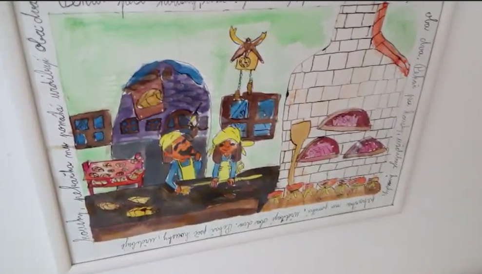
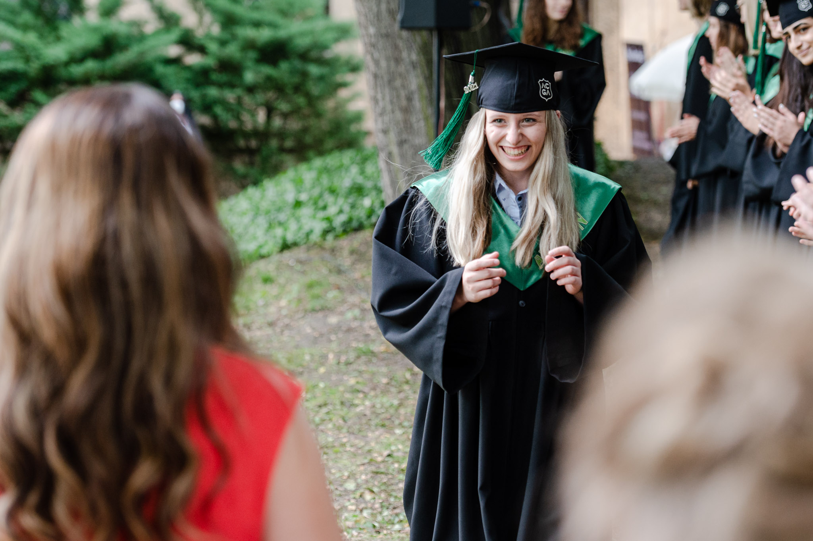
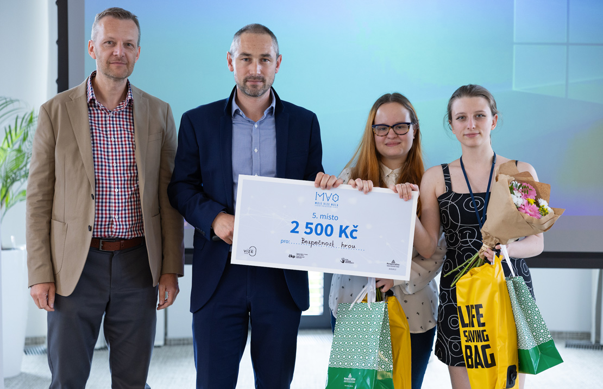

# First impression

# **ABOUT ME**

Hi! I’m Magda, a Czech-based visual storyteller: I love drawing a silly doodle in the corner of my notebook - a story to tell and making the most boring and ordinary object pretty, and aesthetic and giving said object a spark.

My spark for arts started forming when a family put me in arts & crafts and then a painting class at the age of 12. 

One summer afternoon in 2018 I realised that my art was too monotone, and I started to actively improve my skills. That moment gradually led to who I am now, a person who makes illustrations, 3d modelling and animation.

Art in any form has always been my hobby - I enjoy reading and writing and watching short movies but also acting in them. 

Besides sitting in my room all day, I do sports like skiing, swimming and rollerblading, or I just take a walk with my sister and our dog.

# *MY PROUDEST MOMENTS & ACHIEVEMENTS*

## My first art competition my first award.
We start from the bottom of the mountain, and we climb.

## FCE 
A Cambridge certificate that shows that my level of English is B2 – upper-intermediate.
The exam consists of speaking, writing, listening and reading and I passed it in 2019.

## Graduation (2021)

I graduated from English-Czech High School Amazon focused on English. Besides intensive studies of the practical language (6 lessons a week), some subjects were taught in English by native speakers - I also “consumed” a lot of English - reading (both as part of the curriculum and as a hobby) and watching films in the original version. 
The subjects that I graduated from were translation & interpretation and IT.

## MY VISION ZERO: STUDENTS FOR SAFE ROADS

From 1993 to 2022, 28 524 people died on the roads in the Czech Republic. Hundreds more will be added each year,

Vision Zero is zero deaths and serious injuries on the roads.

MY VISION ZERO: STUDENTS FOR SAFE ROADS" was intended for students of Czech universities and secondary schools. The competition aimed to encourage young people to improve the state of road accidents in the Czech Republic

Students or groups of students submitted projects focusing on different areas to solve traffic problems. The projects could address vehicle and road problems as well as road user behaviour and education.

  I registered for the competition as a member of a team of 6 people in the school year 2022/2023.  We did a project called “Learning about safety via a game”. 

Our project focused on traffic education. We designed a concept for a board game for children from kindergarten to 3rd grade of primary school. The aim was to introduce children to the basics of safety, which they can build on in the following years and then expand their knowledge.

In the competition, 118 other projects were registered and we won the 5th place. 

For this game, I illustrated pexeso cards for learning the basics of first aid and telephone numbers of police, ambulance and the police in the Czech Republic I also created magnets and illustrations of dangerous and safe situations 

You can find the whole work [here](https://www.mojevizenula.cz/app/webroot/files/editor/files/MV0%205%20dokumenty/MV0_5_Kydalkova_VSKK_Bezpecnost%20hrou.pdf).

## WORLD HEALTH CONGRESS 2023 PRAGUE

This work was part of my internship. 
What is WHC2023? 

1.  **3D animation**

-*describe the animation*

Creation of the  3D animation, including:

- Brainstorming ideas
- Short 2D animatic of the idea
- Creating models - Earth + logos
- Creating the textures of the logos images that were sent in
- Working with textures and UV
- Animation using the graph editor function
- Parenting 3d log (blocks) to motion path
- Consultation with the boss about the order of the logos of the partner organizations 
- Animation of camera movement
- Parenting the background with the camera
- Animating the rotation of the Earth
- Appropriate lighting of the scene and adjustments to the texture of the earth model
- Online consultation
- Post-production in DaVinci Resolve editing software

**-	Approximately 2000 viewers from 55 countries saw the visual during the congress.**

2. **Technical Team**
Technical clearance for the hybrid (online/physical) convention hall included:

- Training and familiarization with the equipment.
- 3 dress rehearsals before the live broadcast 
- Working with the OBS program 
- Communicating with those in the studio (reordering of the guest speakers, any technical issues)
- Communication with colleagues (e.g.: assistants, host/moderator, sound engineer, cameraman)

# MY WORK

