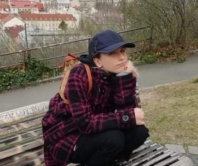
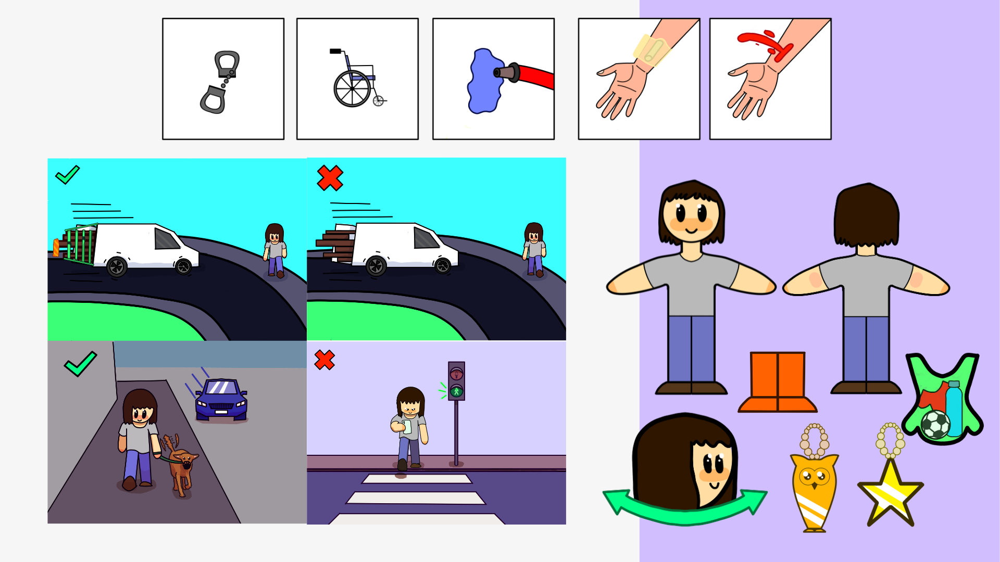
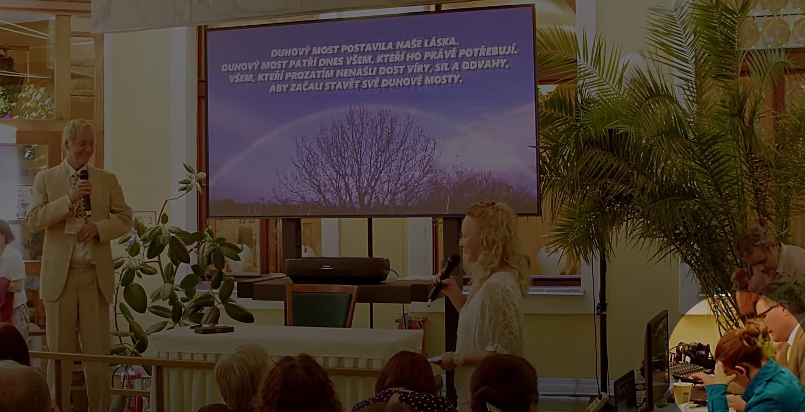
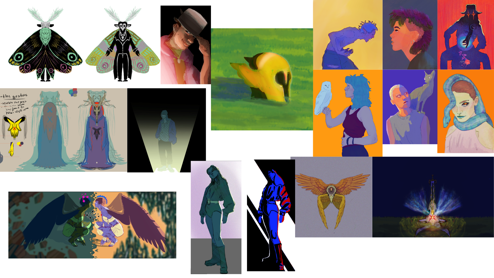
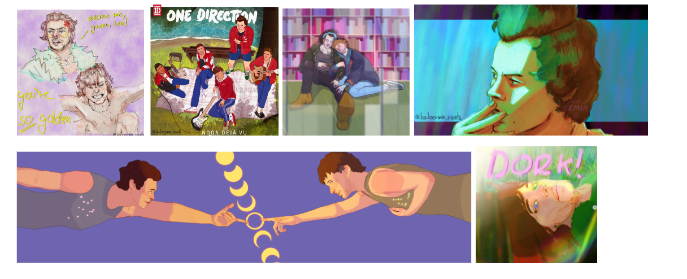

# First impression

# **ABOUT ME**

Hi! I’m Magda, a Czech-based visual storyteller: I love drawing a silly doodle in the corner of my notebook - a story to tell and making the most boring and ordinary object pretty, and aesthetic and giving said object a spark.

My spark for arts started forming when a family put me in arts & crafts and then a painting class at the age of 12. 

One summer afternoon in 2018 I realised that my art was too monotone, and I started to actively improve my skills. That moment gradually led to who I am now, a person who makes illustrations, 3d modelling and animation.

Art in any form has always been my hobby - I enjoy reading and writing and watching short movies but also acting in them. 

Besides sitting in my room all day, I do sports like skiing, swimming and rollerblading, or I just take a walk with my sister and our dog.

# *MY PROUDEST MOMENTS & ACHIEVEMENTS*

## FCE 
A Cambridge certificate that shows that my level of English is B2 – upper-intermediate.
The exam consists of speaking, writing, listening and reading and I passed it in 2019.

## Graduation (2021)

I graduated from English-Czech High School Amazon focused on English. Besides intensive studies of the practical language (6 lessons a week), some subjects were taught in English by native speakers - I also “consumed” a lot of English - reading (both as part of the curriculum and as a hobby) and watching films in the original version. 
The subjects that I graduated from were translation & interpretation and IT.

## MY VISION ZERO: STUDENTS FOR SAFE ROADS

**About the project:**

From 1993 to 2022, 28 524 people died on the roads in the Czech Republic. Hundreds more will be added each year,

Vision Zero is zero deaths and serious injuries on the roads.

MY VISION ZERO: STUDENTS FOR SAFE ROADS" was intended for students of Czech universities and secondary schools. The competition aimed to encourage young people to improve the state of road accidents in the Czech Republic

Students or groups of students submitted projects focusing on different areas to solve traffic problems. The projects could address vehicle and road problems as well as road user behaviour and education.

**The work:**

I registered for the competition as a member of a team of 6 people in the school year 2022/2023.  We did a project called “Learning about safety via a game”. 

Our project focused on traffic education. We designed a concept for a board game for children from kindergarten to 3rd grade of primary school. The aim was to introduce children to the basics of safety, which they can build on in the following years and then expand their knowledge.

In the competition, 118 other projects were registered and we won the 5th place. 

For this game, I illustrated pexeso cards for learning the basics of first aid and telephone numbers of police, ambulance and the police in the Czech Republic I also created magnets and illustrations of dangerous and safe situations.

You can find the whole presentation of the project [here](https://www.mojevizenula.cz/app/webroot/files/editor/files/MV0%205%20dokumenty/MV0_5_Kydalkova_VSKK_Bezpecnost%20hrou.pdf).

## WORLD HEALTH CONGRESS 2023 PRAGUE

This work was part of my internship. [What is WHC2023?](https://www.whc2023prague.com)

1.  **3D animation**

Creating the 3D animation involved several steps. First, I brainstormed ideas and made a short 2D animatic. Then, in modelling and animation software Maya I made models of the Earth and logos and added textures, that I made on my own. Here I utilised UV mapping techniques.
In the animation process, I used the graph editor function for seamless motion, which involved parenting 3D logos to a predefined motion path.  I animated the camera movement and the Earth spinning and also lit the virtual scene.
I worked on post-production in DaVinci Resolve to make the final product and during the whole process, I consulted the project with my boss to make sure that everything looked just as he envisioned. 

**-	Approximately 2000 viewers from 55 countries saw the visual during the congress.**

2. **Technical Team**

I was part of a technical team for technical clearance of the hybrid (online/physical) conference hall. Firstly, I underwent thorough training and familiarization with the equipment and OBS program. Secondly, I conducted three dress rehearsals before the live broadcast.
Finally, during the live broadcast, I communicated with my colleagues in the studio (who managed the order of guest speakers) and in the hall (e.g.: assistants, host/moderator, sound engineer, cameraman). We all solved any technical issues  quickly and swiftly to make sure the flow of the conference was smooth. 

# MY WORK
Here are examples so of work I have done over the past year and a half. Some were not project with a specific target I just drew what had crossed my mind in that particular moment. The drawing evolves on the sketch page and grows like a tree. It branches out and develops as my ideas on the page.

